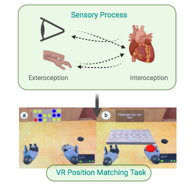

# TSVR 
Hi:

*for a general overview of results, please download zip of the repository, open "R files", open presentation.Rmd file with R Studio program and knit it for a Html page*

## Preliminary Results :heartpulse:
This repository contains preliminary results of the study called "Behavioural changes induced by tactile stimulation in VR". 

**The expirience is built in:**
* Virtual Reality using Unity. 
* The Heart Rate data is colected using Arduino Uno and a SparkFun Single Lead Heart Rate Monitor - AD8232. 
* The VR expirience displayed and tracked using a HTC Vive headset, two lighthouses and Haptic Data Globes. 

On each trial, the participants had to memorize the correct placement position on a 18 position board. Then, the ball would appear allocated randomly on either the left or the right hand and finally they had to place the ball in the correct position as fast as possible. 
Consequently, we manipulate 3 things:
1-The location of the target 
2-The location of the ball in the hand (right hand, left hand)
3-The location of the haptic feedback (congruent, incongruent, absent)
 
The study consisted of 3 blocks of 36 trials, mounting to a goal of 108 observation per participants. 
It is important note that each hand experienced equal number of conditions (randomized) throughout the 108 trials:
36 congruent condition (12 left congruent - 12 right congruent)
36 incongruent condition(12 left incongruent - 12 rightincongruent)
36 absent condition (12 left absent - 12 right absent)

**Hypothesis measurements** 

1. The effect of haptic stimulation:

    * 1.a Main effect of stimulation (congruent, incongruent, absent) on ball placement accuracy.
    For example: participants are most accurate in congruent trials, a little less accurate in absent trials, least accurate in incongruent trials.
   
    * 1.b Main effect of stimulation (congruent, incongruent, absent) on ball placement time.The research was carried out inserting to the participant into a room in which he had to 
   
**In the repository you will find:**

   * Readme file
   * Folder with Data Examples
   * Folder with Matlab Files containing the data organization, outlier removal, subsetting and ECG signal processing.
      * all_participants.m (goes over all participants and builds a structure with all the data)
         * load_everything.m (how to load the files)
         * building_response_time.m (builds response time structure)
            * feedbacktype_check.m(checks number of stimuli per participant)
      * preparing_for_R.m (this file rescues the structured data, saves it as s csv file to later use in R and continues to add the mistakes)
      * HEART.m (adds IBI data into the file to be analyzed by R)
   * Folder with R files containing the ANOVAS and Graphs.
      * anovas.R
      * responsetime.csv (actually it holds response time and accuracy data that work with the anova file.)
      * presentation.Rmd (it presents the code in anovas.R and show the ongoing analysis processing)
      
   Thank you, 
   TSVR 

